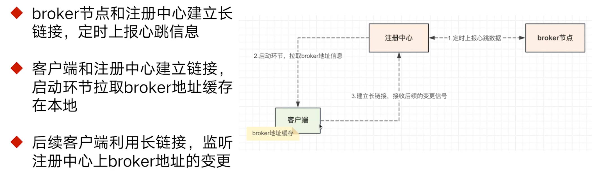

监控、中间件、架构领域

思维导图

环境准备

- jdk8
- Maven 3.5+
- Netty、SpringBoot

## 常用消息队列原理

### RabbitMq

开源的高性能、可扩展、消息中间件，实现了 `AMQP` 协议，可以帮助不同应用程序之间进行通信和数据交换。

核心思想是将发送者 producer 与接收者 consumer 完全解耦，实现异步处理和低耦合度的系统架构。 

#### Exchange机制的⼏种类型

- Fanout 类型（广播模式）

- Direct 类型（直接模式）：根据routing_key将消息投递到指定的队列上。

- Topic 类型（灵活，支持通配符的方式）

- Header 类型：更为细粒度的匹配逻辑，在投递消息的请求头上，注⼊多个header参数，路由规则是根据header的参

  数去决定要投递哪个队列，这种模式⽐较少⽤

#### 消息错误处理

消费异常的数据，会被投递到⼀条**死信队列**⾥⾯，后边重新再拉取消费。

举例：消费端消费消息，写⼊db。（db的连接池满了，数据写⼊失败。消息重试：晚点再消费⼀次消息，过

⼀段时间再去消费。）

#### 消息顺序消费

RabbitMQ的顺序消费能⼒不⾏，消费者如果使⽤多线程消费，⽆法保证多线程的处理顺序。

多个消费者对应⼀条队列，也是会有顺序错乱的问题。

什么场景下，才会对顺序消费，要求这么严格？

（binlog同步，基于canal去做mysql的binlog订阅，开⼀个单独的服务，专⻔接收binlog后，会发送 mq消息出来。）

#### 消息的重复存储（不足点）

假设⼀条消息，满⾜匹配规则，需要投递到多个不同的队列上，那么相同的消息需要在不同的队列上都保存⼀份，重复数据造成占⽤空间资源浪费。

routing_key: user.dev.pre.prod.id。

msg：{ "order":11011,"user_id":1011 }

### RocketMq

基于Java语⾔实现，阿⾥巴巴内部开源产品，⽬前已经捐献给apache组织。整体性能要强于 RabbitMQ 许多，可以达到10w+并发的吞吐量。

官⽅地址：https://rocketmq.apache.org/docs/quickStart/01quickstart/

#### 组成部分

- Broker
- NameServer（注册中⼼）

客⼾端和NameServer建⽴⻓链接，然后获取得到Broker的地址，再去访问Broker进⾏消息的投递和消费。

#### 发送链路

从RocketMQ和RabbitMQ的消息发送链路来看，会有⼀些出⼊：

- RocketMQ的消息主要都存放在了CommitLog⾥⾯，在消费队列存储的是消息的“索引”信息。
- RocketMQ的⼀条队列，⼀次只能允许被⼀个消费者占⽤，不能让多个消费者访问。

#### 消费组概念

RocketMQ⾥⾯会有消费组的概念，即同⼀个topic下会有多个消费者，多个消费者可以组成不同的组别。⽽同⼀个组别的多个消费者们所持有的队列是互斥的。

#### 消息回溯功能

在RocketMQ官⽅提供的控制台上，是具备这⽅⾯能⼒的。20:00 - 21:00 (100w)

#### 事务消息

主要⽤于解决分布式事务的业务场景。

RocketMQ在4.3.0版中开始⽀持分布式事务消息，RocketMQ采⽤了2PC的思想来实现了提交事务消息，同时增加⼀个补偿逻辑来处理⼆阶段超时或者失败的消息。

#### 延迟消息

RocketMQ会在broker端，将需要延迟的消息都放在⼀个备份区域中（按照延迟的level放到不同的queue⾥⾯去），然后有⼀个定时任务，扫描到期的数据，到期之后就将消息重新放⼊到对应队列⾥⾯。

#### 高性能原理

- 读写磁盘⾼性能的本质原因MMap技术

将磁盘空间映射到了内存区域，接着所有的写操作都是直接写⼊到了该块内存区域，然后根据策略同步/异步持久化到了磁盘中，这相对于传统的io磁盘性能要更⾼效。

#### RocketMQ对mmap技术的⼀些优化

- 预映射 + 内存锁定 (系统内核的api调⽤)

在RocketMQ启动阶段，会先提前预先锁定内存映射模块，避免映射的内存被操作系统给置换了出去。

### Kafka

Kafka 是由 Linkedin（领英）公司开发的，它是⼀个分布式的，⽀持多分区、多副本，可基于Zookeeper 的分布式消息流平台，它同时也是⼀款开源的基于发布订阅模式的消息引擎系统。

Kafka在官⽹的定位其实是⼀款流处理平台，它除了⽀持常⻅的消息队列功能之外，还⽀持实时计算这类能⼒。不过kafka在实时计算这块没有flink做的更加完善，所以⽤的⼈不是很多，⼤家使⽤Kafka更多会⽤于消息队列。

#### Kafka与Zookeeper

Kafka早期版本和zookeeper其实是需要组合使⽤的，不过后边的架构设计中，在逐渐的解除和zk的耦合。早期的Kafka架构设计⾥⾯，Zookeeper主要是负责管理起具体的broker机器信息。

- Broker启动的时候，把地址注册到broker上，也就是/kafka/broker/ids⽬录下写⼊broker的id。
- 然后多个broker争先抢占zk的⼀个节点，在/kafka/controller⽬录下，抢占到该节点的broker是 Controller⻆⾊（分布式锁思路），主要负责后续的topic编辑，分区管理等作⽤。这台Broker上会保存集群中最全的Broker数据信息，其他的Broker节点需要定期往这台机器上报⾃⼰的信息。

摒弃了zk依赖之后，其实后边Kafka使⽤了⾃研的 Controller Quorum 替换了之前zk的⻆⾊。

#### Kafka的消息发送和消费链路

假设我们的topic名称叫做A

在Kafka的集群架构⾥⾯，不同的Partition⽂件会被分散到不同的Broker上存放，这样可以让不同的机器负责不同的Partition⽂件写⼊，可以保证同⼀个Topic下的消息写⼊不会只单单受限于单台机器的硬件性能。

#### 消息存储原理

Kafka⾥⾯的消息存储实际上是存在⼀个个不同的segment⾥⾯的。

所谓的segment其实也是⼀个虚拟的概念，实际映射到物理磁盘上，分成了.log,.index,.timestamp⽂件的组合。

- .log⽂件：实际的数据存储⽂件，顺序写⼊存储。
-  .index⽂件：索引⽂件，⾥⾯保存了具体消息存在于.log的地址信息。
- .timestamp⽂件：⽤于记录哪些消息是7天以内的，如果超过了7天，⼀般消息默认会被删除。

#### Kafka读写数据的⾼性能原理

- 写⼊数据⽤了MMap技术
- 消费者拉取数据使⽤了 SendFile 技术
- 传统数据在⽹卡上的发送链路

- 使⽤SendFile技术后，数据在⽹卡端的发送链路

### 三种消息队列对比

## 架构设计篇

- 存储模块
- 检索模块
- 集群架构设计
- 复杂功能的设计

### CommitLog—MQ的消息存在哪

单文件存储

多文件存储

存储体结构

### ConsumerQueue—面对多消费者，消息的分配如何设计

队列锁定与重分配

### 为什么要用注册中心

客户端如何感知Broker节点的变化

客户端对于注册中心来说，就是远端通过 RPC访问的一个特殊进程。

### 多节点存储的架构如何实现

即集群下的数据同步问题

## 数据存储核心

